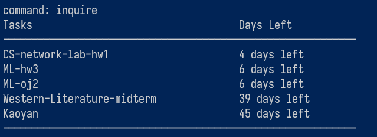
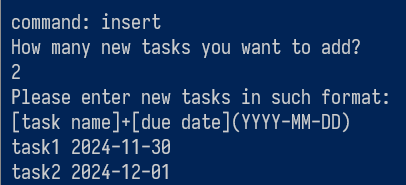
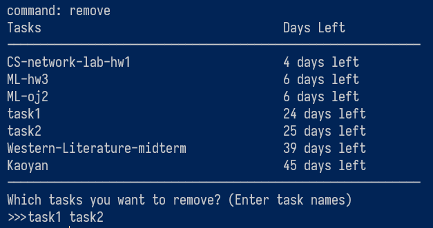

# 【python新手项目】基于命令行交互的任务调度管理器
尝试用python写了一个可以通过命令行窗口交互的任务调度管理器，通俗点讲就是手机上的“重要事项”APP。用pyinstaller进行打包，用Pickle包进行保存和加载，实现程序数据长期化。

## 使用方法
在你的电脑终端输入
`git clone https://github.com/FrederichII/python_terminal-based-schedule-manager.git`

运行 `python_terminal-based-schedule-manager/dist/scheduler/scheduler.exe` 即可开始使用
### 基本操作
* `inquire`: `查询现有的任务及剩余时间

* `insert`: 添加新任务。注意先输入要添加的任务数量，按ENTER后再按照`<name> <due date>(YYYY-MM-DD)`的格式每行输入一个任务，程序会自动根据截止日期计算剩余天数，并在显示的时候按剩余天数升序排列显示

* `remove`: 从列表中删除任务。直接输入你想要删除的任务的名称，格式按照: `<task1_name> <task2_name> <task3_name>`。

* `reset`: 重置任务列表 / 清空所有任务。
* `save`: 保存任务列表。程序调用的Pickle包会将包含任务名称和截止日期以及截止时间的字典保存到`/dist/scheduler`下的`date.pkl`和`day.pkl`中，下次程序启动时会加载这两个文件。
* `quit`: 保存任务列表并退出程序